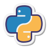

<h1 align="center">Проект web и mobile автотестов</h1>
<p align="center">
<a href="https://notion.so">
  
</a>
</p>


<h4 align="center">Python | Pytest | Selene | Appium | Jenkins | Allure | Selenoid | Browserstack | Telegram</h4>
<h4 align="center">
      &nbsp;&nbsp;&nbsp;&nbsp;&nbsp;
      &nbsp;&nbsp;&nbsp;&nbsp;&nbsp;
      &nbsp;&nbsp;&nbsp;&nbsp;&nbsp;
      &nbsp;&nbsp;&nbsp;&nbsp;&nbsp;
     &nbsp;&nbsp;&nbsp;&nbsp;&nbsp;
      &nbsp;&nbsp;&nbsp;&nbsp;&nbsp;
    &nbsp;&nbsp;&nbsp;&nbsp;&nbsp;
    &nbsp;&nbsp;&nbsp;&nbsp;&nbsp;

</h4>


---

### Реализованы тесты:
#### Web
- [x] Авторизация по временному коду
- [x] Добавление страницы
- [x] Добавление подстраницы
- [x] Публикация страницы
- [x] Создание пространства команды
- [x] Создание страницы из шаблона
- [x] Добавление страницы в избранное
#### Mobile
- [x] Авторизация по временному коду
- [x] Добавление страницы
- [x] Поиск страницы
- [x] Удаление страницы

## Запуск тестов
---
### Удаленно
> <a target="_blank" href="https://jenkins.autotests.cloud/job/C09-vbr_s-diploma/">Ссылка на проект в Jenkins</a>
#### Для запуска автотестов в Jenkins

1. Выбрать пункт `Build now`  
   * Запуск веб тестов на selenoid: `tests/web --context=selenoid`  
   * Запуск мобильных тестов в browserstack: `tests/mobile --context=bstack`  
2. Результат запуска сборки можно посмотреть в отчёте Allure


### Локально

1. Клонировать репозиторий 
```bash
git clone https://github.com/vinterbris/qa_guru_python_9_24.git
```
2. Создать и активировать виртуальное окружение
```bash
python -m venv .venv 
source .venv/bin/activate 
```
3. Установить зависимости
```
pip install -r requirements.txt 
```

#### Варианты запуска:

* Веб на selenoid
* Веб локально
* Мобильные на browserstack
* Мобильные на локальном эмуляторе или реальном телефоне

```bash
pytest tests/web --context=selenoid
pytest tests/web --context=local
tests/mobile --context=bstack
tests/mobile --context=local_mobile
```

#### Получение отчета allure
```bazaar
allure serve
```


Для локального запуска мобильных тестов требуется запуск appium командой:

```
appium --base-path /wd/hub
```

Для совершения логина используется сервис временной почты mailslurp:
В `.env` указываются id почтового ящика и api ключ:`MAIL_SLURP_API_KEY`,`MAIL_SLURP_INBOX_ID`

На локальном мобильном устройстве можно использовать гугл учетную запись. Для этого нужно переключить в .env
`USE_GOOGLE = True`

## Оповещения в мессенджер

> _Настроена отправка оповещений в телеграм канал. Возможна настройка для email, slack, discord, skype, mattermost_

_img incoming_


## Примеры запуска тестов
---
### Веб
https://github.com/vinterbris/qa_guru_python_9_24/assets/21102027/3f1aed6b-81fc-4469-9c73-3bf83a0c5d88

### Мобильных
https://github.com/vinterbris/qa_guru_python_9_24/assets/21102027/be7f4e28-4f6b-4023-afef-b68c09904981


